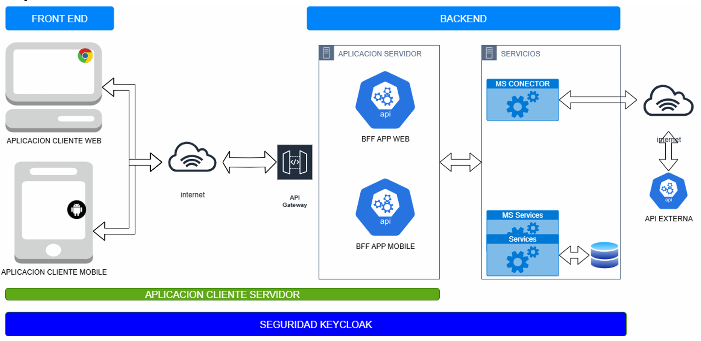

# FrontEnd-DACS2025

Aplicación frontend de DACS2025.

## Descripción

Este proyecto corresponde a la interfaz de usuario de la aplicación principal. Su objetivo es ofrecer una experiencia interactiva y amigable, permitiendo a los usuarios acceder y visualizar la información proveniente de los distintos servicios del backend a través del Backend For Frontend (BFF). Incluye funcionalidades de autenticación, autorización y consumo de APIs, centralizando la interacción con el sistema de manera segura y eficiente.

## Objetivo

## Configuracion
[Ver la configuración de infraestructura (PDF)](assets/DACS-configuracion-de-infraestructura.pdf)